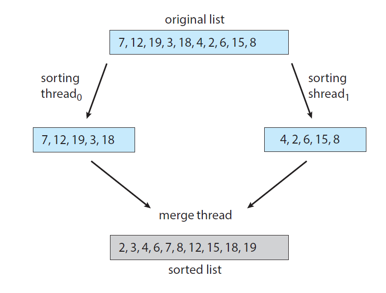

#HW2

## Part 1
Write a multithreaded program using C or C++ that calculates various
statistical values for a list of numbers. This program will take a series of numbers
on the command line and creates three separate worker threads. One thread
will determine the average of the numbers, the second will determine the
maximum value, and the third will determine the minimum value. For example,
the inputs of the program are the following integers:
```
90 81 78 95 79 72 85
```
The program will report:
```
The average value is 82
The minimum value is 72
The maximum value is 95
```
The variables representing the average, minimum, and maximum values will be
stored globally. The worker threads will set these values, and the parent thread
will output the values once the workers have exited.

## Part 2

Write a multithreaded sorting program, using C or C++, that works as follows: A
list of integers is divided into two smaller lists of equal size. Two separate
threads (which we will term sorting threads) sort each sublist using a sorting
algorithm of your choice. The two sublists are then merged by a third thread—a
merging thread —which merges the two sublists into a single sorted list. Because
global data are shared across all threads, perhaps the easiest way to set up the
data is to create a global array. Each sorting thread will work on half of this array.
A second global array of the same size as the unsorted integer array will also be
established. The merging thread will then merge the two sublists into this
second array. Graphically, this program is structured according to the following
example:



This programming project will require passing parameters to each of the sorting
threads. In particular, it will be necessary to identify the starting index from
which each thread is to begin sorting. The parent thread will output the sorted
array once all sorting threads have exited.
