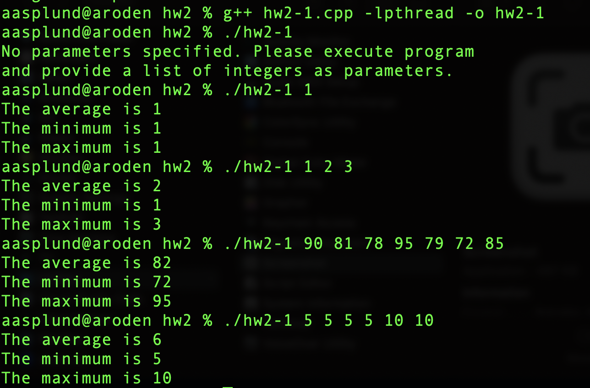
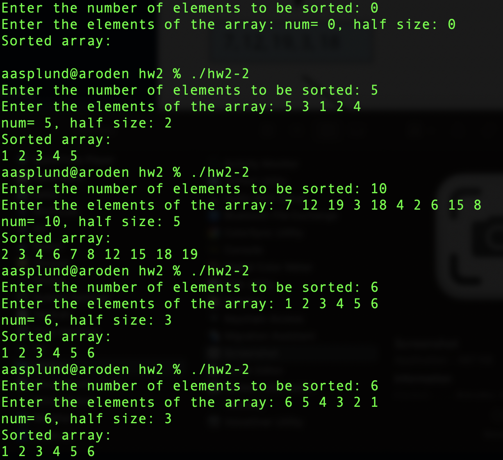
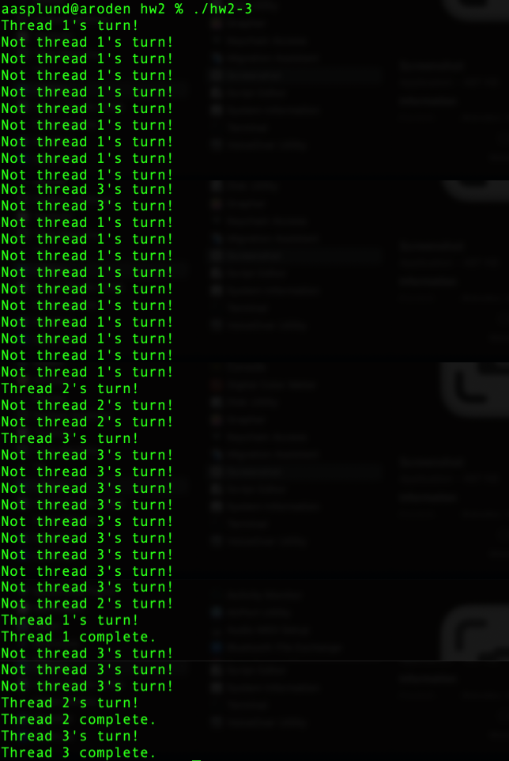

# HW2-1
Write a multithreaded program using C or C++ that calculates various statistical values for a list of numbers. This program will take a series of numbers on the command line and creates three separate worker threads. One thread will determine the average of the numbers, the second will determine the maximum value, and the third will determine the minimum value.

The variables representing the average, minimum, and maximum values will be stored globally. The worker threads will set these values, and the parent thread will output the values once the workers have exited.

## Program Code
Please see attached .cpp file.

## Output Results

---

# HW2-2

Write a multithreaded sorting program, using C or C++, that works as follows: A list of integers is divided into two smaller lists of equal size. Two separate threads (which we will term sorting threads) sort each sublist using a sorting algorithm of your choice. The two sublists are then merged by a third thread—a merging thread —which merges the two sublists into a single sorted list. Because global data are shared across all threads, perhaps the easiest way to set up the data is to create a global array. Each sorting thread will work on half of this array. A second global array of the same size as the unsorted integer array will also be established. The merging thread will then merge the two sublists into this second array.

This programming project will require passing parameters to each of the sorting threads. In particular, it will be necessary to identify the starting index from which each thread is to begin sorting. The parent thread will output the sorted array once all sorting threads have exited.

## Program Code
Please see attached .cpp file.

## Output Results

---

# HW2-3

This question aims to write a multithreaded program in C or C++ that explores synchronization challenges. Assume that we have a shared variable allowed_ID. This variable is initialized to 1 at the beginning. Now create three threads in your program and assign ID 1,2,3 to them, respectively. Pass the ID as a parameter when you create the threads. Each of the threads will try to access the variable “allowed_ID.” Whenever a thread reads this variable, it checks whether the allowed_ID is equal to its ID or not. If, for example, thread 2 reads allowed_ID and sees that this variable is not 2, it prints “Not thread 2’s turn” and releases the variable. Otherwise, thread 2 prints “Thread 2’s turn!” and increases the allowed_ID by 1, and releases the variable. However, after increasing allowed_ID by 1, if it is 4, the thread will reset the variable to 1 before releasing the variable. The program should execute until each thread prints “Thread i’s turn!” two times. Once a thread prints this message twice, it terminates.

## Program Code
Please see attached .cpp file.

## Output Results

